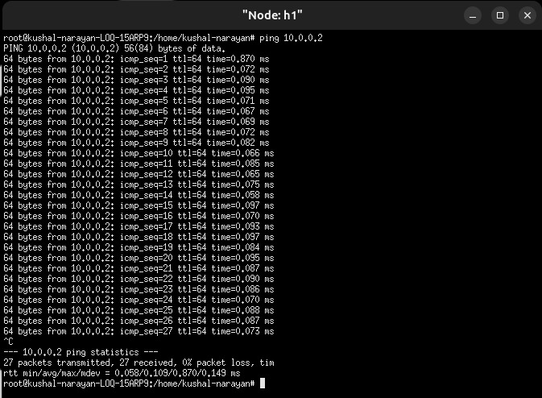
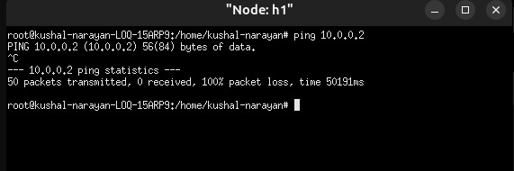
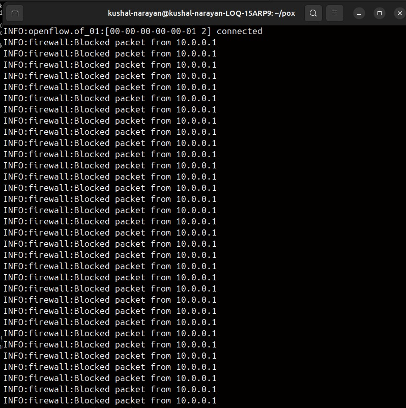
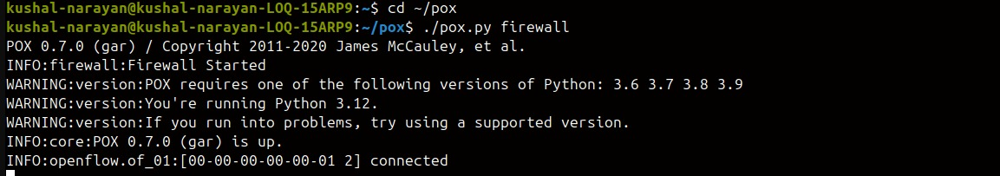
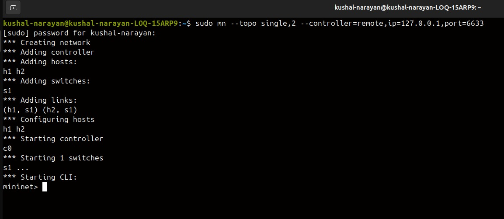
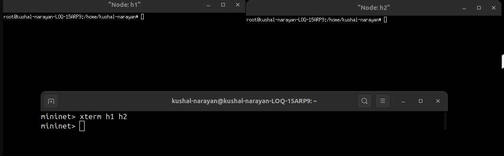

# Controller-Based Firewall using SDN

## Overview
This project implements a controller-based firewall using Software Defined Networking (SDN). The firewall is developed using the POX controller and Mininet emulator to monitor and control network traffic based on predefined rules.

---

## Objective
- Design a firewall using SDN architecture  
- Control traffic using IP-based rules  
- Block unauthorized communication  
- Maintain logs of blocked packets  

---

## SDN Architecture
- Control Plane → POX Controller  
- Data Plane → OpenFlow Switch (Mininet)  
- Hosts → h1 (10.0.0.1), h2 (10.0.0.2)  

---

## Network Topology
- 1 Switch (s1)  
- 2 Hosts (h1, h2)  
- Both hosts connected to one switch  

---

## Technologies Used
- Python  
- POX Controller  
- Mininet  
- OpenFlow  

---

## Implementation
- Controller listens for PacketIn events  
- Extracts source IP  
- Applies rule-based filtering  

Rule:
- Block traffic from 10.0.0.1  
- Allow all other traffic  

---

## Performance Evaluation

### Before Firewall
- Ping successful  
- 0% packet loss  

---

### After Firewall
- Ping failed  
- 100% packet loss  

---

### Controller Logs

---

## How to Run

### Start Controller
cd pox  
./pox.py firewall  

### Run Mininet
sudo mn --topo single,2 --controller=remote,ip=127.0.0.1,port=6633  

### Test
mininet> xterm h1 h2  
ping 10.0.0.2  

---

## Screenshots
## Performance Evaluation

### Before Firewall

---

### After Firewall

---

### Controller Logs

---

### Controller Running

---

### Mininet Topology

---

### Host Terminals

---

## Author
GAGANASHREE R 

---

## Conclusion
This project demonstrates a controller-based firewall using SDN. The system successfully blocks traffic based on IP rules and logs blocked packets.
